# CrossingGuard 🚂🚧✅

A railway crossing modeled in multiple formal verification tools to demonstrate model checking concepts like safety, liveness, and real-time constraints.


## Table of Contents

- [Problem Description](#problem-description)
- [Model Components](#model-components)
  - [States](#states)
  - [State Machines](#state-machines)
    - [Train](#train)
    - [Gate Controller](#gate-controller)
    - [System Interaction](#system-interaction)
  - [Processes](#processes)
  - [Properties to Verify](#properties-to-verify)
- [Project Structure](#project-structure)
- [Models](#models)
- [Verified Implementations](#verified-implementations)
- [Tool Comparison](#tool-comparison)
- [Key Concepts by Tool](#key-concepts-by-tool)
- [Experiments](#experiments)
- [Further Reading](#further-reading)

## Problem Description

A train approaches a railway crossing with a gate. The system must ensure:

- **Safety**: The train never crosses while the gate is open
- **Liveness**: The train eventually completes its crossing

## Model Components

### States

- **Train positions**: FAR → NEAR → CROSSING → GONE (cyclic)
- **Gate states**: OPEN ↔ CLOSED

### State Machines

#### Train


#### Gate Controller

```mermaid
stateDiagram-v2
    direction LR
    [*] --> OPEN
    OPEN --> CLOSED : close [train = NEAR]
    CLOSED --> OPEN : open [train ∈ {GONE, FAR}]
```



#### System Interaction

```mermaid
sequenceDiagram
    participant T as Train
    participant G as Gate Controller

    Note over T: FAR
    T->>T: approach → NEAR
    T->>G: train is NEAR
    G->>G: close gate → CLOSED
    Note over G: CLOSED
    T->>T: enter → CROSSING
    Note over T: ⚠️ Safety: gate MUST be CLOSED here
    T->>T: pass → GONE
    T->>G: train is GONE
    G->>G: open gate → OPEN
    Note over G: OPEN
    T->>T: reset → FAR
```



### Processes

1. **Train**: Moves through positions, waits for gate to close before crossing
2. **GateController**: Opens and closes the gate based on train position

### Properties to Verify

1. **Safety (LTL)**: `[] ((train_position == CROSSING) -> (gate_state == CLOSED))`
   - "Always, if the train is crossing, then the gate is closed"
   - This prevents accidents

2. **Liveness (LTL)**: `[] ((train_position == NEAR) -> (<>(train_position == GONE)))`
   - "Always, if the train is near, eventually it will be gone"
   - This prevents deadlock/starvation

## Project Structure

```
.
├── models/
│   ├── spin/            # SPIN / Promela
│   ├── nusmv/           # NuSMV
│   ├── tlaplus/         # TLA+ / TLC
│   └── uppaal/          # UPPAAL timed automata
├── implementations/
│   ├── dafny/           # Dafny (verified code)
│   ├── spark_ada/       # SPARK Ada (contracts + GNATprove)
│   └── scade/           # SCADE / Lustre (synchronous dataflow)
├── Dockerfile           # All-in-one model-checker image
└── README.md
```

## Models

The same railway crossing is modeled in four different tools, each with its own strengths:

| File | Tool | Logic | Key Feature |
|------|------|-------|-------------|
| `models/spin/railway_crossing.pml` | SPIN | LTL | Explicit-state, asynchronous concurrency |
| `models/nusmv/railway_crossing.smv` | NuSMV | CTL + LTL | Symbolic (BDD-based), synchronous |
| `models/tlaplus/RailwayCrossing.tla` | TLA+ / TLC | TLA+ | Action-based specs, fairness constraints |
| `models/uppaal/railway_crossing.xml` | UPPAAL | TCTL | Real-time clocks and timed automata |

---

### SPIN (Promela)

```bash
# Install
sudo apt-get install spin   # or: brew install spin

# Verify
spin -a models/spin/railway_crossing.pml
gcc -o pan pan.c
./pan -a -N safety
./pan -a -N progress
```

### NuSMV

```bash
# Install: https://nusmv.fbk.eu/ (or nuXmv: https://nuxmv.fbk.eu/)

# Verify all properties at once
NuSMV models/nusmv/railway_crossing.smv

# Interactive mode
NuSMV -int models/nusmv/railway_crossing.smv
```

### TLA+ (TLC)

```bash
# Install: https://github.com/tlaplus/tlaplus/releases
# Or use the VS Code TLA+ extension

# Verify (cfg file specifies invariants and properties)
cd models/tlaplus
java -jar tla2tools.jar -config RailwayCrossing.cfg RailwayCrossing.tla
```

### UPPAAL

```bash
# Install: https://uppaal.org/ (GUI-based tool)

# Open railway_crossing.xml in UPPAAL
# Load queries from railway_crossing.q in the Verifier tab
# Or use command-line verifier:
verifyta models/uppaal/railway_crossing.xml models/uppaal/railway_crossing.q
```

## Verified Implementations

Code generated from the formal models, preserving proven safety properties via language-level verification:

| File | Language | Verification | Key Feature |
|------|----------|-------------|-------------|
| `implementations/dafny/RailwayCrossing.dfy` | Dafny | Compile-time proofs | Ghost predicates, pre/post conditions |
| `implementations/spark_ada/railway_crossing.ads/adb` | SPARK Ada | GNATprove | Contracts (`Pre`/`Post`), used in ERTMS/ETCS |
| `implementations/scade/railway_crossing.lus` | Lustre (SCADE) | Kind 2 / Lesar | Synchronous dataflow, DO-178C certified |

### Dafny

```bash
# Option 1: Install locally
# Via .NET:  dotnet tool install --global dafny
# Or grab a release: https://github.com/dafny-lang/dafny/releases

# Verify only (type-checks + proves all pre/post conditions)
dafny verify implementations/dafny/RailwayCrossing.dfy

# Verify + compile + run the Main() demo
dafny run implementations/dafny/RailwayCrossing.dfy

# Option 2: Run via Docker (no install required)
docker run --rm -v "$(pwd)":/src -w /src dafnylang/dafny run implementations/dafny/RailwayCrossing.dfy
```

The Dafny implementation uses a `ghost predicate Valid()` as the class invariant.
Every method requires `Valid()` on entry and ensures it on exit — the Dafny verifier
proves at compile time that the safety property is maintained across all transitions.

### SPARK Ada

```bash
# Option 1: Install GNAT + SPARK
# Download GNAT Community Edition: https://www.adacore.com/community
# (includes gprbuild, gnatprove, and the SPARK toolset)
# Or via Alire: https://alire.ada.dev/ (preferred)

# Prove contracts (formal verification — no execution needed)
cd implementations/spark_ada
gnatprove -P railway_crossing.gpr --level=2

# Build and run the demo program
gprbuild -P railway_crossing.gpr
./obj/main

# Option 2: Run via Docker (no install required)
docker run --rm -v "$(pwd)":/src -w /src/implementations/spark_ada \
  ghcr.io/alire-project/docker/gnat:14 \
  bash -c "gnatprove -P railway_crossing.gpr --level=2 && gprbuild -P railway_crossing.gpr && ./obj/main"
```

The SPARK Ada implementation uses `Pre`/`Post` contracts on every procedure,
with `Is_Safe` as the invariant function. GNATprove verifies all contracts
without executing the code — the same approach used in ERTMS/ETCS railway signaling.

### SCADE / Lustre

```bash
# Option 1: Install Kind 2 (open-source Lustre model checker)
# Via opam:  opam install kind2
# Or grab a release: https://kind2-mc.github.io/kind2/

# Verify the safety property
kind2 implementations/scade/railway_crossing.lus --main Observer

# Option 2: Run via Docker (no install required)
docker run --rm -v "$(pwd)":/src -w /src kind2/kind2 implementations/scade/railway_crossing.lus --main Observer

# Or import into SCADE Suite for certified code generation (DO-178C / EN 50128)
```

The Lustre node models the crossing as a synchronous dataflow system.
The `Observer` node asserts the safety property (`---%PROPERTY OK`) which
Kind 2 verifies for all reachable states. SCADE Suite can generate
certified C/Ada code from this specification.

## Tool Comparison

| Aspect | SPIN | NuSMV | TLA+ | UPPAAL |
|--------|------|-------|------|--------|
| **State representation** | Explicit | Symbolic (BDD) | Explicit | Zones (DBM) |
| **Temporal logic** | LTL | CTL + LTL | TLA+ | TCTL |
| **Concurrency** | Async (interleaving) | Sync (lock-step) | Async (actions) | Async (timed) |
| **Real-time clocks** | No | No | No | Yes |
| **Fairness** | Weak (acceptance cycles) | CTL fairness | WF/SF built-in | Urgent channels |
| **Typical use** | Protocols, concurrency | Hardware, protocols | Distributed systems | Real-time, embedded |

## Key Concepts by Tool

### Promela / SPIN

- `atomic { }` prevents interleaving between guard and body
- LTL temporal operators need explicit parentheses: `<>(expr)`
- `active proctype` spawns concurrent processes

### NuSMV

- Synchronous: all `ASSIGN` rules fire simultaneously each step
- Supports both CTL (`AG`, `EF`, `AF`, `EG`) and LTL (`G`, `F`, `X`, `U`)
- `case/esac` blocks define conditional next-state transitions

### TLA+

- Actions are predicates over current and next state (primed variables)
- `WF_vars(Action)` = weak fairness (if action is continuously enabled, it eventually fires)
- `~>` (leads-to) is syntactic sugar for `[](P => <>Q)`
- Safety checked as an invariant, liveness as a temporal property

### UPPAAL

- Timed automata with clock variables and location invariants
- `chan` synchronization (sender `!` / receiver `?`) for process coordination
- Location invariants force progress (e.g., `x <= 10` means "must leave within 10 t.u.")
- TCTL queries: `A[]` (always), `A<>` (always eventually), `E<>` (reachable)

### Dafny

- `ghost predicate` defines properties checked at compile time (not at runtime)
- `requires` / `ensures` on every method form a proof chain
- `method Main()` demonstrates a full valid execution path

### SPARK Ada

- `SPARK_Mode => On` activates formal verification
- `Pre` / `Post` contracts are mathematically proven by GNATprove
- Used in production railway signaling (ERTMS/ETCS Level 2)

### Lustre / SCADE

- Synchronous dataflow: every variable has a value at every tick
- `pre` operator references the previous cycle's value
- `->` operator initializes the first tick (`init -> rest` uses `init` at tick 0, `rest` thereafter)
- `--%PROPERTY` annotations define properties for Kind 2

## Experiments

Try modifying any model to introduce bugs:
- Remove the gate-closed guard from the train — the safety property will fail
- Remove fairness (TLA+) or `atomic` (SPIN) — watch for liveness violations
- In UPPAAL, change the clock bound — the real-time constraint will break
- In Dafny, remove a `requires Valid()` — the verifier will reject the code
- In SPARK Ada, weaken a `Post` contract — GNATprove will flag the gap

The model checker / verifier will detect these violations!

## Further Reading

### Model Checkers
- [SPIN Model Checker](http://spinroot.com/)
- [NuSMV](https://nusmv.fbk.eu/) / [nuXmv](https://nuxmv.fbk.eu/)
- [TLA+ Home](https://lamport.azurewebsites.net/tla/tla.html) / [Learn TLA+](https://learntla.com/)
- [UPPAAL](https://uppaal.org/)

### Verified Languages
- [Dafny](https://dafny.org/) — Program verification language (Microsoft Research)
- [SPARK Ada](https://www.adacore.com/about-spark) — Formally verifiable Ada subset
- [SCADE Suite](https://www.ansys.com/products/embedded-software/ansys-scade-suite) — Certified code generation
- [Kind 2](https://kind2-mc.github.io/kind2/) — Open-source Lustre model checker

### Notation
- LTL Operators: `[]` = always, `<>` = eventually, `->` = implies
- CTL Operators: `AG` = always, `EF` = possibly eventually, `AF` = inevitably, `EG` = possibly always
- Real railway systems (e.g. ERTMS/ETCS) use similar formal methods for safety certification
